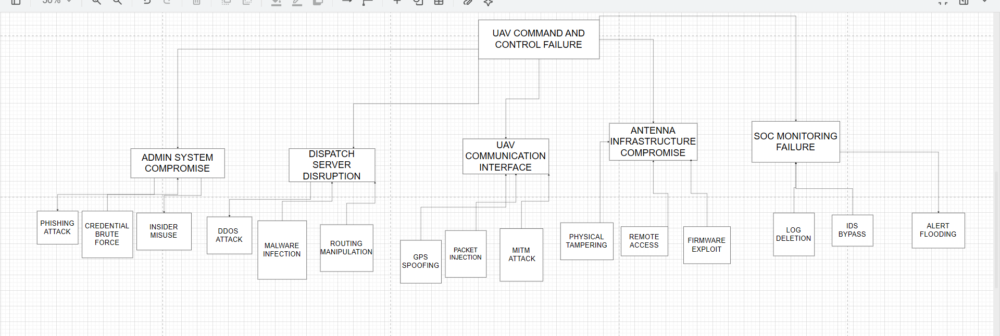

# UAV Wave Risk Assessment — Smart City Cyber-Physical Security

A full NIST SP 800-30 Rev.1 risk assessment on a simulated smart-city UAV deployment, using Attack Tree threat modelling to identify and evaluate 7 cyber-physical security events across a UAV fleet, dispatch control, communications, and SOC monitoring infrastructure.

## Overview

UAV Wave systems combine physical UAV operations with communication networks, control servers, administrative interfaces, and SOC monitoring — creating cyber-physical risk that can affect both service continuity and public safety at city scale. This assessment identifies the highest-priority risks in that infrastructure and recommends controls to mitigate them.

## Methodology

- **Framework:** NIST SP 800-30 Revision 1, chosen for its support of consistent threat/vulnerability/likelihood/impact scoring across interconnected digital and physical assets
- **Threat modelling:** Attack Tree analysis, tracing paths to the top event of "loss of safe operational command and control of the UAV Wave system"
- **Asset identification:** 7 core assets identified (UAV Fleet, Communication Network, Dispatch Control Server, Administrative Control System, Antenna Infrastructure, System Monitoring, Operational Data/Telemetry)
- **Data-driven scoring:** a simulated dataset (SOC alerts, admin access logs, UAV activity records) analysed in Excel to support likelihood and impact scoring using a 5×5 risk matrix (Risk = Likelihood × Impact)

## Attack Tree



## Key Findings

| Event | Risk Score | Risk Level |
|---|---|---|
| Dispatch Control Server Disruption | 20 | Critical |
| Administrative System Compromise | 15 | High |
| UAV Communication Interference | 12 | High |
| Antenna Infrastructure Compromise | 8 | Medium |

Centralised control systems, communication infrastructure, and navigation mechanisms carry the highest risk, since disruption in these areas has the greatest operational effect. Recommended controls include multi-factor authentication and privilege separation for administrative access, redundancy and network segmentation for dispatch systems, and encryption/integrity protection for UAV communications and navigation signals.

## Repository Structure

```
├── README.md
├── UAV_Wave_Risk_Assessment_Report.pdf   # Full report: methodology, threat modelling, risk matrix, recommendations
├── attack_tree_diagram.png               # Attack tree for the top-level threat event
├── raw_soc_alerts.csv                    # Simulated SOC alert records
├── raw_admin_alerts.csv                  # Simulated administrative access logs
├── raw_uav_activity.csv                  # Simulated UAV operational activity records
└── treated_risk_summary.csv              # Final scored risk events (likelihood, impact, risk score, risk level)
```

## Tools Used

NIST SP 800-30 Rev.1, Attack Tree threat modelling, Microsoft Excel (risk scoring and dataset analysis)

## Note on data

All datasets in this repository are simulated for the purposes of this assessment. No real systems, organisations, or individuals are represented.
